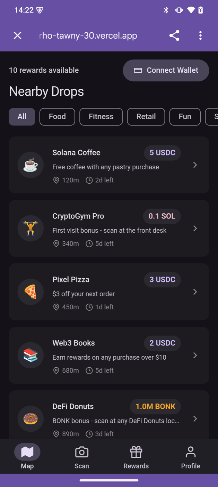
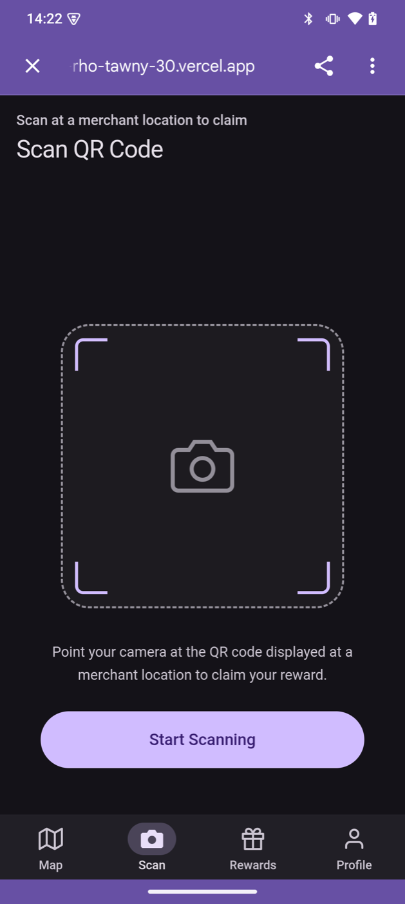
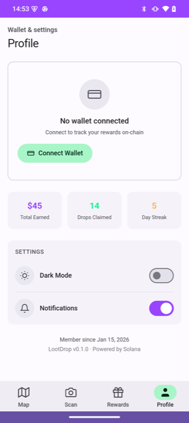

<h1 align="center">
  <br/>
  LootDrop
  <br/>
</h1>

<h4 align="center">Production-ready TWA template for the Solana dApp Store</h4>

<p align="center">
  <a href="https://web-rho-tawny-30.vercel.app">Live Demo</a> &nbsp;&bull;&nbsp;
  <a href="#screenshots">Screenshots</a> &nbsp;&bull;&nbsp;
  <a href="#quick-start">Quick Start</a> &nbsp;&bull;&nbsp;
  <a href="GUIDE.md">Bubblewrap Guide</a>
</p>

<p align="center">
  
  
  
  
  
  
  
  
</p>

---

## Screenshots

Fullscreen TWA running on **Solana Mobile Seeker** — no browser chrome:

<p align="center">
  
  &nbsp;
  
  &nbsp;
  
  &nbsp;
  
</p>

<p align="center"><sub>Home &nbsp;&bull;&nbsp; Scan &nbsp;&bull;&nbsp; Rewards &nbsp;&bull;&nbsp; Profile</sub></p>

## About

LootDrop is a **production-ready TWA (Trusted Web Activity) template** for publishing mobile-optimized apps to the **Solana dApp Store** via [Bubblewrap CLI](https://github.com/GoogleChromeLabs/bubblewrap).

It demonstrates every optimization needed for a high-quality TWA on Solana Mobile — from MWA wallet connection and fullscreen rendering to Material Design 3 theming and offline caching — using a location-based crypto rewards concept as a real-world showcase.

Built for the [Solana Mobile PWA Improved Template RFP](https://solanamobile.com/grants).

## Key Features

### RFP Deliverables

| Deliverable | Status | Implementation |
|---|---|---|
| Sample TWA with Bubblewrap | Done | SvelteKit 5 + TWA via Bubblewrap / PWABuilder |
| Improved splash screen | Done | Solana-branded loading with MD3 circular progress |
| Chrome default + WebView fallback | Done | Chrome Custom Tabs primary, WebView fallback |
| Mobile-intuitive navigation | Done | MD3 bottom nav bar (Map, Scan, Rewards, Profile) |

### Mobile Optimizations

- **Fullscreen TWA** — Digital Asset Links verified, zero browser chrome on Android
- **Offline-first** — Service worker with cache-first for static assets, self-hosted fonts
- **Pull-to-refresh** — Native-feeling gesture with MD3 refresh indicator
- **Dark mode** — System-preference detection + manual toggle, MD3 color tokens
- **Touch optimized** — 44px+ tap targets, ripple feedback, `touch-manipulation`
- **Safe areas** — Notch / punch-hole / gesture bar handling via `env(safe-area-inset-*)`
- **Responsive** — `clamp()` typography, fluid layouts, tested 320px–800px+
- **Lighthouse** — Performance 96, Accessibility 100, Best Practices 100
- **Web Vitals** — CLS, FID, LCP, FCP, TTFB monitoring built-in

### Solana Integration

- **Mobile Wallet Adapter (MWA)** — real Seed Vault connection via `@solana-mobile/wallet-adapter-mobile`
- **On-chain balance** — fetches real SOL balance on connect (`@solana/web3.js`)
- **Mock fallback** — graceful demo mode on non-Solana devices
- **Solana Pay** — deep link placeholders for merchant QR codes
- **Anchor scaffold** — on-chain reward escrow smart contract

### Developer Experience

- **Single config** — edit `config.ts` to customize app name, colors, tokens, network
- **GitHub Actions CI** — auto build + type check on every push
- **Step-by-step guide** — [`GUIDE.md`](GUIDE.md) covers Bubblewrap, DAL, dApp Store submission
- **TypeScript** — full type safety with Svelte 5 runes

## Tech Stack

| Layer | Technology |
|---|---|
| Framework | **SvelteKit 5** (Svelte 5 runes) + TypeScript |
| Styling | **Tailwind CSS 4** + Material Design 3 tokens |
| Wallet | **@solana-mobile/wallet-adapter-mobile** (MWA) |
| Blockchain | **@solana/web3.js** (devnet / mainnet) |
| TWA | Web App Manifest + Service Worker + Digital Asset Links |
| Android | **Bubblewrap** / PWABuilder → APK + AAB |
| Monitoring | **web-vitals** (CLS, FID, LCP, FCP, TTFB) |
| CI | **GitHub Actions** (build + type check) |
| Deployment | Vercel (adapter-static) |
| Smart Contract | Anchor (Rust) — scaffold |

## Quick Start

### Run locally

```bash
cd web
npm install
npm run dev
# → http://localhost:5173
```

### Build for production

```bash
cd web
npm run build    # outputs to build/
npm run preview  # preview at http://localhost:4173
```

### Customize

Edit **one file** to rebrand the template:

```bash
web/src/lib/config.ts
```

Change app name, Solana colors, token list, network cluster, TWA package name — all in one place.

## Bubblewrap / TWA

See the full **[Bubblewrap Guide](GUIDE.md)** for step-by-step instructions.

Quick version:

```bash
npm i -g @bubblewrap/cli
cd web
bubblewrap init --manifest twa-manifest.json
bubblewrap build
# → app-release-signed.apk
```

### Digital Asset Links

The `/.well-known/assetlinks.json` is pre-configured. This enables **fullscreen mode** — no Chrome URL bar.

To use your own signing key:
```bash
keytool -list -v -keystore your.keystore | grep SHA256
```

Update the fingerprint in `web/static/.well-known/assetlinks.json`.

## Project Structure

```
lootdrop/
├── web/                          # SvelteKit TWA (main deliverable)
│   ├── src/
│   │   ├── routes/               # /, /scan, /rewards, /profile
│   │   └── lib/
│   │       ├── config.ts         # ← Single file to customize everything
│   │       ├── components/       # BottomNav, DropCard, SplashScreen, ...
│   │       ├── stores/           # Svelte 5 runes + MWA wallet connection
│   │       ├── data/             # Mock businesses & rewards
│   │       └── types/            # TypeScript interfaces
│   ├── static/
│   │   ├── .well-known/          # Digital Asset Links
│   │   ├── fonts/                # Self-hosted Roboto (woff2)
│   │   ├── icons/                # App icons (192/512 PNG + maskable)
│   │   ├── manifest.json         # Web App Manifest
│   │   └── sw.js                 # Service worker (cache v3)
│   └── twa-manifest.json         # Bubblewrap TWA config
├── .github/workflows/ci.yml      # GitHub Actions CI
├── GUIDE.md                      # Step-by-step Bubblewrap tutorial
├── programs/lootdrop/            # Anchor smart contract scaffold
└── backend/                      # FastAPI merchant API scaffold
```

## Roadmap

- [x] **v0.1** — Project scaffold, smart contract, QR SDK
- [x] **v0.2** — SvelteKit TWA with mobile UI
- [x] **v0.3** — TWA wrapping + Material Design 3 + fullscreen DAL
- [x] **v0.4** — MWA wallet connection, Lighthouse audit, CI, config system, Bubblewrap guide
- [ ] **v0.5** — Real camera QR scanning (zxing-js)
- [ ] **v0.6** — Merchant dashboard + backend API
- [ ] **v1.0** — Mainnet launch

## License

[MIT](LICENSE) — Michal Kosiorek
